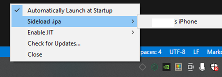
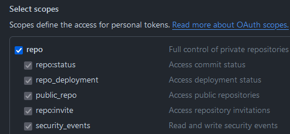
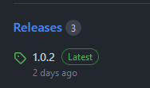
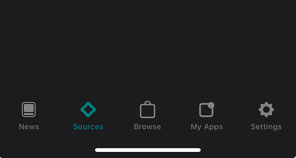
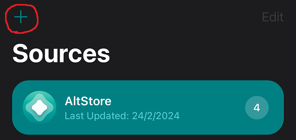
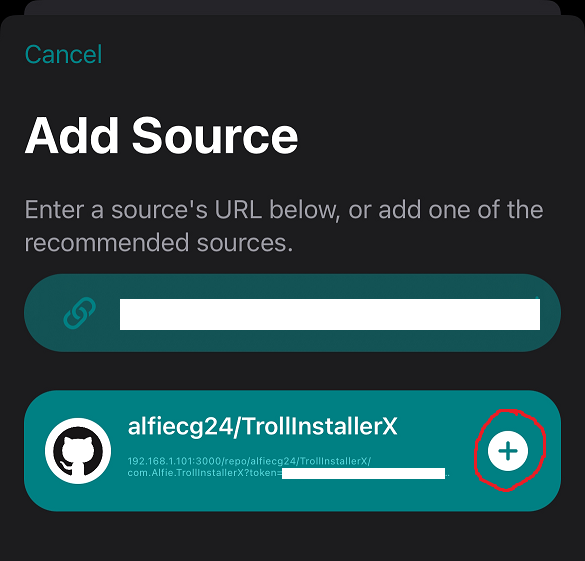

# altstore-github

altstore-github is a http API to easily generate altstore sources from github repos

## why use this?

if you want automatic updates for an app but the developer does not use an altstore source, and they instead only release new versions on github.

## how do i use this?

first you'll need a few things:

1. the beta version of altstore, which supports custom sources
2. a github API access token
3. the bundle ID for the app

this document will show you how to get each of these

### 1. altstore beta

currently, the stable version of altstore does not support custom sources, so you'll need to download the beta version. this is advertised as being exclusive to users who donate to the altstore patreon, but you can actually install it for free, legally. (it's publicly available on the official altstore website)

1. install [the release version of AltServer](https://altstore.io/#Downloads) on your computer
2. download the beta version of AltStore to your computer from [the official altstore source](https://cdn.altstore.io/file/altstore/apps/altstore/2_0_rc.ipa). (you can view the source online using [AltSource browse](https://altsource.by.lao.sb/browse/?source=https%3A%2F%2Fapps.altstore.io))
3. run AltServer and wait for the icon to appear on your system tray
4. plug your device into your PC (this step is not necessary if wifi sync is enabled for your device in itunes)
5. hold down the shift key and click the altserver tray icon, select "Sideload .ipa", then pick your device:
   
6. select the `.ipa` file you downloaded
7. enter your apple ID & password, then wait for it to install

### 2. github access token

1. if you don't have one already, you'll need to [create a github account](https://github.com/signup)
2. navigate to [the access token settings](https://github.com/settings/tokens/new) and enter a name for your token.
    - if the github repo you want to generate a source from is _public_, **do not check any boxes**. the default access is all it needs
    - if the github repo is _private_, **check the "repo" checkbox**:
      

### 3. the app's bundle ID

in order for the altstore-github to generate a valid altstore source, it needs to know the app's bundle ID.

1. go to the releases page for the repo you want to generate an altstore source from:
   
2. download the `.ipa` file from the assets in one of the releases (it doesn't matter which one, the bundle ID should never change between versions):
   
3. upload it to [ScarletParse](https://debianarch64.github.io/ScarletParseWE/)
4. copy the value from the "BundleID" field

### creating your altstore source

now that you have all the required information, you need to create the source URL:

```
http://<hostname (TODO)>/<github user>/<github repo name>/<app bundle ID>?token=<github access token>
```

for example, if i want to create a source for https://github.com/alfiecg24/TrollInstallerX, the URL would look like this:

http://hostname/alfiecg24/TrollInstallerX/com.Alfie.TrollInstallerX?token=xxxxxxxxxxxxxxxxxxxxxxxxxxxxxxxxxxxxxxxxx

### adding your source to altstore

1. open AltStore on your device
2. press the "Sources" tab:
   
3. press the `+` icon:
   
4. enter the source URL you created then press the `+` icon:
   

### done

you can now install the app from the source. new github releases will now show up as updates to the app in AltStore
